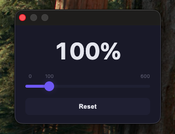

# Simple Volume Control

<p align="center">
  
</p>

<p align="center">
  <strong>A minimalist Chrome extension for controlling tab volume</strong>
</p>

<p align="center">
  
  
  
</p>

<p align="center">
  <a href="README.ja.md">🇯🇵 日本語</a>
</p>

---

## ✨ Features

- **Minimal UI** — Just a volume slider and a reset button
- **0% – 600% volume range** — Boost or reduce with a single slider
- **Tab-level audio control** — Powered by `tabCapture` + Web Audio API, independent of site implementation
- **Dark theme** — Clean and easy on the eyes

## 📸 Screenshot

<p align="center">
  
</p>

## 🎯 Use Cases

- Normalize volume differences between YouTube videos
- Boost audio on quiet websites
- Replace over-complicated volume extensions with something simple

## 🛠 Architecture

```
popup (UI)
  ↓ message
service_worker
  ↓ stream ID / state management
offscreen document
  ↓
Web Audio API (GainNode → AudioDestination)
```

| Technology | Purpose |
|---|---|
| Manifest V3 | Chrome extension framework |
| tabCapture API | Capture tab audio stream |
| Offscreen Document | Background audio processing |
| Web Audio API (GainNode) | Volume gain control |

## 📁 Project Structure

```
Simple-Volume-Control/
├── manifest.json          # Extension configuration
├── service_worker.js      # Background logic & tab management
├── offscreen.html         # Offscreen Document (HTML)
├── offscreen.js           # Audio processing (Web Audio API)
├── popup/
│   ├── popup.html         # Popup UI
│   ├── popup.css          # Styles (dark theme)
│   └── popup.js           # UI logic
└── icons/
    ├── icon16.png
    ├── icon48.png
    └── icon128.png
```

## 🚀 Installation

1. Clone or download this repository
   ```bash
   git clone https://github.com/P0KEBAN/Simple-Volume-Control.git
   ```
2. Open `chrome://extensions/` in Chrome
3. Enable **Developer mode** (top right)
4. Click **Load unpacked**
5. Select the cloned folder

## 💡 Usage

1. Click the extension icon on a tab playing audio
2. Adjust the slider (0% – 600%)
3. Click `Reset` to return to 100%

## ⚠️ Notes

- Some tabs (e.g. `chrome://` pages) do not support audio capture
- Extreme volume boost may cause audio clipping
- Volume settings are session-only (reset when the tab is closed)

## 🔧 Permissions

| Permission | Reason |
|---|---|
| `tabCapture` | Capture the audio stream of a tab |
| `offscreen` | Process audio in the background |
| `activeTab` | Access the current tab info |

## 📄 License

[MIT License](LICENSE)
